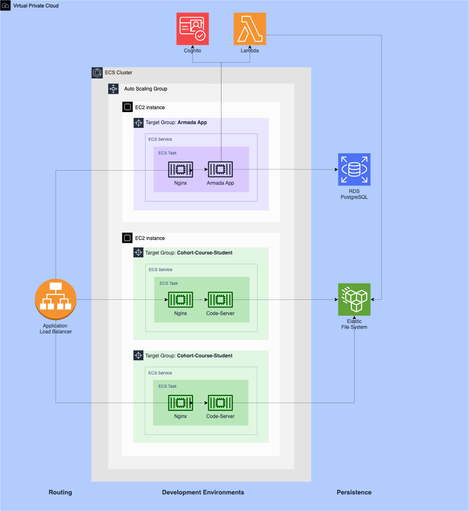

## Hi there, I'm Sergio! 👋
**I'm a software engineer based in Starkville, Mississippi.** 🗺️ I have several years of experience in JavaScript, TypeScript and a variety of frameworks. I have extensive experience with AWS and hold 2 associate-level certifications: [AWS Certified Developer - Associate](https://www.credly.com/badges/f840dff9-f881-47d0-a393-0344a8708a72?source=linked_in_profile) and [AWS Certified Solutions Architect - Associate](https://www.credly.com/badges/685b8261-f7c2-4ec2-87d2-edea5db08e33/public_url). 

### I'm also a co-creator of ✨ [Armada](https://team-armada.github.io/) ✨ 

Armada is an open-source application to configure and deploy containerized development environments. 

We built Armada using the following technologies: TypeScript, PostgreSQL, VPC, EC2, ELB, ECS, EFC, Cognito, Lambda and the AWS Cloud Development Kit. 

### Personal information
- 🌎 [sergiojpichardo.com](https://sergiojpichardo.com/)
- ✅ [Resume](https://sergiojpichardo.com/static/files/resume-sergio-pichardo.pdf)
- 👔 [Linkedin](https://www.linkedin.com/in/sergiopichardo/) 
- ✉️ [Email](hello@sergiojpichardo.com)

<!--
**sergiopichardo/sergiopichardo** is a ✨ _special_ ✨ repository because its `README.md` (this file) appears on your GitHub profile.

Here are some ideas to get you started:

- 🔭 I’m currently working on ...
- 🌱 I’m currently learning ...
- 👯 I’m looking to collaborate on ...
- 🤔 I’m looking for help with ...
- 💬 Ask me about ...
- 📫 How to reach me: ...
- 😄 Pronouns: ...
- ⚡ Fun fact: ...
-->
